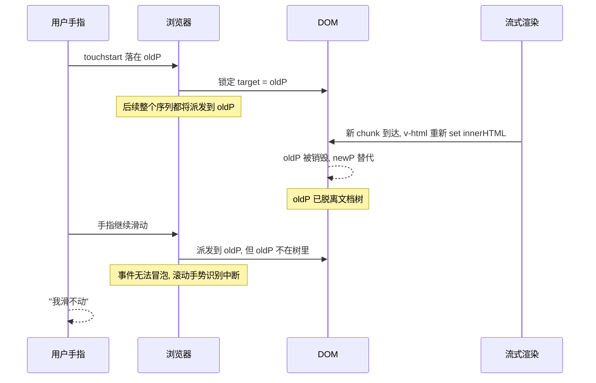

# 一次让我重新理解 touchmove 的线上 Debug

> 一个 AI Chat 页面在模型流式回答时，用户按住屏幕滑不动。我以为是 CSS 的事，结果一路追到了 W3C 规范。

## 0. 先把场景画出来

我们做的是一个移动端的 AI Chat。用户问一个问题，模型流式吐 token，回答区一边刷新一边长大。所有人都熟悉这个交互。

某天 QA 提了一个让人皱眉的 bug：

> **iPhone 上，当模型正在回答时，手指按在回答区里上下滑动，页面纹丝不动。等回答结束、或者把手指挪到回答区以外，滚动又正常了。**

第一反应：什么离奇 bug？我打开同一个页面，发完消息开始疯狂滑屏，竟然真的一动不动。手指像吸在了一块橡皮泥上。

模型答完，舒一口气，再滑——丝滑。

> 这个项目就是把当时的现场用最小代码复刻出来了，配套一个浮窗探针，可以亲自看 touch 事件被吞的瞬间。复现版本：[github.com/mosuzi/touchmove](.)，运行 `pnpm install && pnpm dev` 即可。

---

## 1. 错误的方向 #1：CSS

最先怀疑 CSS。理由很合理：移动端"滑不动"九成是 `touch-action`、`overflow`、`overscroll-behavior` 这几个属性出问题。

挨个排查：

- 滚动容器 `overflow-y: auto`？✅
- 父链上有没有谁意外写了 `touch-action: none`？❌ 没有
- 有没有谁写了全屏 `overflow: hidden`？❌ 没有
- 给容器加 `touch-action: pan-y` 加固？尝试了，无效

排除了一遍，CSS 上看不出任何能锁死滚动的东西。而且更诡异的是——**这个 bug 只在"模型回答中"这几秒里出现**。CSS 是静态的，不会一会儿生效一会儿失效。

排查方向错了。

## 2. 错误的方向 #2：passive listener

我们项目里其实有个全局的 `touchmove` 监听用来做下拉刷新。第二个怀疑是：是不是哪里 `preventDefault()` 把滚动阻断了？

```js
document.addEventListener('touchmove', e => {
  // 万一这里 preventDefault 了……
})
```

但翻了一圈，监听都是 `{ passive: true }` 加的，根本调不了 `preventDefault`。而且 Chrome 现在对 root 上的非 passive 监听本身就警告，团队里很注意。

再次排除。

## 3. 装个探针看个究竟

到这里，我决定不再"靠脑子推理"，先把事实摆到面前：

```js
window.addEventListener('touchstart', e => console.log('start', e.target), { passive: true, capture: true })
window.addEventListener('touchmove',  e => console.log('move',  e.target), { passive: true, capture: true })
window.addEventListener('touchend',   e => console.log('end',   e.target), { passive: true, capture: true })
```

打开 DevTools 移动模拟模式（Cmd+Shift+M），模型开始回答的时候按住回答区上下滑。控制台输出长这样：

```
start <p>...</p>
move  <p>...</p>
move  <p>...</p>
// 接下来什么都没了，一直滑也没有
end   <p>...</p>   ← 松手才出现
```

> ⚠ touchmove 在两三次之后**完全停止派发**。

这就是关键证据。问题不在 CSS，不在 `preventDefault`——**事件从源头就不再来了**。

那是浏览器在偷懒吗？显然不是。手指明明在动。

## 4. 抓出真凶：盯着 e.target 看

既然事件不来了，我开始怀疑 `target` 本身。

我把探针改了一行：

```js
window.addEventListener('touchmove', e => {
  console.log('move', e.target, 'attached?', document.contains(e.target))
}, { passive: true, capture: true })
```

再复现一次：

```
start <p>...</p> attached? true
move  <p>...</p> attached? true
move  <p>...</p> attached? false   ← !!!
// 再无后续
```

**touchstart 时手指落到的那个 `<p>`，在第二次 touchmove 之后，就脱离文档树了。**

我盯着这行看了大概十秒，然后想起来回答区是怎么渲染的：

```vue
<div class="answer" v-html="renderedHtml" />
```

```js
const renderedHtml = computed(() => marked.parse(answer.value))
```

每来一个 token，`answer.value += chunk`，computed 重新跑一次 `marked.parse`，整段 HTML 重新 set 到 `.answer.innerHTML` 上——**`.answer` 下面所有 `<p>/<li>/<code>` 子节点每帧都被销毁重建**。

用户手指此刻正按在某个 `<p>` 上。

那个 `<p>` 被销毁了。

`document.contains(e.target)` 当然是 `false`。

> 我盯着屏幕笑了一下。这种"看似 CSS 问题，实则是渲染问题"的 bug，简直就是给"全栈工程师"准备的钓鱼线。

## 5. 但是——为什么浏览器不自己处理？

这里其实有一个不太直觉的地方：

> "就算 target 被销毁了，手指明明还在屏幕上动，浏览器为什么不继续派发 touchmove 给它的祖先/document/window？"

我也愣了好久。直到去翻了 W3C Touch Events 规范才豁然开朗：

> A user agent must dispatch the `touchmove` event(s) to the same `EventTarget` as the `touchstart` event that corresponded to the touch point, **even if the touch point has since moved outside the interactive area of the original target**.
>
> —— [W3C Touch Events Level 2 §5.7](https://www.w3.org/TR/touch-events/#event-touchmove)

翻译：**一次触摸序列（touchstart → touchmove\* → touchend）的 target 在 touchstart 那一刻就被锁定了**，整个序列都派发到这同一个 target，即使手指移出原始 target 的范围。

这条规则是为了解决另一个更常见的问题——"用户按下时把手指放在按钮上，往外滑动时按钮的 hover 状态、release 行为依然由那个按钮接管"。规范要求 target 必须稳定，否则手势识别就乱了。

但这条规则隐含了一个前提：**那个 target 在整个序列内必须留在 DOM 树里**。

如果你在 touchmove 还没结束的时候，悄悄把那个节点从 DOM 里抽走（无论是 `innerHTML = newHTML`、`v-html`、`dangerouslySetInnerHTML`、还是 Vue/React diff 的销毁重建），浏览器只能按规范继续派发到一个**已经不在文档里**的节点上。结果是：

1. 你挂在 `window` / `document` 上的 touchmove 监听拿不到事件——因为冒泡链断了；
2. **更要命的是**：浏览器内部用来识别滚动手势的逻辑也拿不到事件，**原生滚动直接停摆**。

iOS Safari 上这个行为最严重，Android Chrome 视版本会有不同程度的优雅降级，但仍能感受到肉眼可见的卡顿。

时序图大概是这样：



## 6. 修复：把"重画"换成"追加"

知道根因后修复就简单了。**核心心法只有一句**：

> **流式渲染是"追加"，不是"重画"。让 DOM 像河流一样只增不删。**

具体到代码，把 v-html 整段重渲染换成 token 列表增量 push：

```diff
- <div class="answer" v-html="renderedHtml" />
+ <div class="answer">
+   <span v-for="(t, i) in tokens" :key="i">{{ t }}</span>
+ </div>
```

```diff
- answer.value = answer.value + chunk            // 整段字符串 reassign
+ tokens.value.push(chunk)                       // 只 push 新 token
```

效果立竿见影：每个 chunk 到达，只是在 `.answer` 末尾 `appendChild` 一个新的 `<span>`，前面所有 span（包括手指正按住的那个）一动不动。target 永远在 DOM 里，touchmove 序列完整派发，原生滚动手势识别一切正常。

再加一点 CSS 加固：

```css
.answer-scroll {
  touch-action: pan-y;          /* 告诉浏览器这里只滚不缩放，可以激进接管手势 */
  overscroll-behavior: contain; /* 阻止滚动链穿透 */
}
```

这两条不是修 bug 的，是给浏览器**更明确的信号**让它优化手势处理。

## 7. 流式 markdown 怎么办

有人会说："我业务上必须渲染 markdown，不能只渲染纯文本。"

合理。流式 markdown 是个天然和"增量 append"不友好的场景，因为后面的字符可能改变前面段落的结构（比如 ```` ``` ```` 收尾、列表项继续）。三个选项按优先级：

1. **流式阶段只渲染纯文本，结束时再做一次完整 `marked.parse` 替换**。简单粗暴，UX 上能接受。
2. **使用支持增量插入的流式 markdown 解析器**（如 [streaming-markdown](https://github.com/thetarnav/streaming-markdown)），它能在已有 DOM 上做局部插入而不是整段替换。
3. **把"滚动容器"和"markdown 重建容器"解耦**。让滚动落在一个外层稳定节点上，markdown 内部怎么重建都行，反正 touchstart 不会落进去。

如果以上都不行，最后兜底：

4. **touchstart 时暂存所有新 chunk 不渲染，touchend 后 flush**。代价是用户滚动期间回答会"停一下"，但能 100% 避开问题。

## 8. 复盘：那些容易踩的写法

写完修复，回头看了一圈代码，发现"等价于整段重画"的写法其实非常多。下面这些都会踩坑：

| 写法 | 为什么有问题 |
| --- | --- |
| `el.innerHTML = newHtml` | 经典整段替换 |
| `el.innerHTML += chunk` | **不是追加！** 等价于先序列化整个 innerHTML 再重新解析，旧节点全没了 |
| Vue `v-html="parsed"` | 每次 set innerHTML |
| React `dangerouslySetInnerHTML={{__html: parsed}}` | 同上 |
| `:key="msg.content"` / `key={msg.content}` | 内容变 → key 变 → 整个组件 unmount+mount |
| `messages = [...messages]` + 无稳定 key | React/Vue 按位置 diff，仍可能销毁子树 |
| `replaceChildren(newNodes)` | 同样会清空旧子节点 |

判断一段渲染代码会不会出问题，可以用一个最简单的标准：**模型多吐一个 token，DOM Inspector 里那个老节点的 `outerHTML` 引用还在不在？**

## 9. Checklist：下次遇到"按住就滑不动"

按这个顺序排查，能省下你半天：

1. **装探针**：在 `window` 上挂 `touchstart`/`touchmove`/`touchend` 监听，打 log；
2. **看 touchmove 是否真的来**：如果根本不派发，方向就明确了（不要再去研究 CSS）；
3. **看 `document.contains(e.target)`**：是 `false` 就锁定"原 target 被销毁"方向；
4. **录 Performance**：看流式期间是不是每帧大量 DOM 节点 detach/attach；
5. **审视渲染代码**：搜 `v-html` / `dangerouslySetInnerHTML` / `innerHTML =` / `innerHTML +=`；
6. **审视 key**：搜所有 `:key` / `key={`，看有没有绑到会变化的值；
7. **改成增量 append + 稳定 id key + `touch-action: pan-y` 加固**，多半就解决了。

## 10. 一点感想

这个 bug 让我重新理解了几件事：

- **"渲染层"和"输入层"是耦合的**。我们写惯了 React/Vue 这种声明式 UI，习惯把 DOM 当成"渲染完就甩出去"的产物。但 DOM 同时也是输入事件的载体，节点的"身份连续性"对触摸/手势事件来说非常重要。
- **规范读一读**，比想破脑袋猜要快得多。touch events 这一章其实不长，半小时读完，就能解释为什么世界上的滑动会"卡"。
- **流式 UI 是个被低估的复杂场景**。它把"高频 DOM 更新"和"长时间持续"两个特性叠加在了一起，几乎所有平时不会出问题的反模式都会被放大。AI 时代这种场景只会越来越多，这一类 bug 还会再出现。

希望下次你也遇到"按住屏幕滑不动"的时候，能少走那 80% 的弯路，直接打开 DevTools 看 `document.contains(e.target)`。

---

## 附录：参考链接

- [W3C Touch Events Level 2 — touchmove](https://www.w3.org/TR/touch-events/#event-touchmove)
- [MDN — Touch events](https://developer.mozilla.org/en-US/docs/Web/API/Touch_events)
- [MDN — `touch-action`](https://developer.mozilla.org/en-US/docs/Web/CSS/touch-action)
- [MDN — `overscroll-behavior`](https://developer.mozilla.org/en-US/docs/Web/CSS/overscroll-behavior)
- [Vue — 使用 key 维护列表状态](https://cn.vuejs.org/guide/essentials/list.html#maintaining-state-with-key)
- 本文配套 demo：[touchmove-bug-demo](./README.md)
