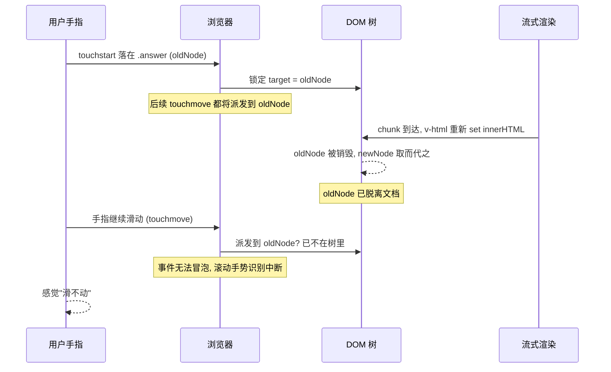

# touchmove 失效问题 demo

复现并记录一个移动端 AI chat 场景下的真实 bug：**模型流式输出过程中，用户在回答区按住屏幕无法滚动**。

> 想看故事化的 debug 全过程？读这篇配套博客 → [《一次让我重新理解 touchmove 的线上 Debug》](BLOG.md)

仓库提供两个对照页面：

- `/bug`：使用 `v-html` 整段重渲染 + `:key` 绑到 content 的"踩坑"实现；
- `/fixed`：使用 token 增量 append + 稳定 id 的修复实现。

页面右上角有一个 `TouchProbe` 探针，实时显示 `touchstart`/`touchmove`/`touchend` 的派发计数以及"最近一次 touchstart 的 target 是否还在 DOM 里"，可以让 bug 肉眼可见。

---

## 一、运行

```bash
pnpm install
pnpm dev
```

Vite 会以 `--host` 启动，输出形如 `http://192.168.x.x:5173/`。在以下任一环境打开：

- **真机**（推荐）：手机和电脑在同一局域网，用手机浏览器访问局域网地址；
- **桌面 Chrome DevTools**：打开 DevTools → 切到 Device Toolbar（Cmd/Ctrl+Shift+M）→ 选 iPhone 等机型 → 刷新页面。

> ⚠️ 一定要在"会触发 touch 事件"的环境里测试。普通桌面浏览器只触发 mouse 事件，看不到 bug。

---

## 二、复现步骤

> 关键：demo 把滚动范围**限制在 assistant 回答框内部**（外层页面不滚动）。这样用户的 touchstart 必然落在被 v-html 销毁的子节点（`<p>` / `<li>` / `<code>` ...）上，bug 触发非常稳定。

1. 进入 `#/bug`；
2. 点击底部 **开始回答** 按钮，模型开始以 30ms / token 的速度流式输出一段几千字的回答；
3. 在中间灰色 **assistant 回答框** 内按住屏幕，尝试上下滑动；
4. 观察：
   - 回答框**滚不动**，手指像在橡皮上滑；
   - 右上角探针 `move` 计数停留在很小的值后**停止增长**；
   - `attached` 显示红色的 `NO` —— 说明 `touchstart` 时的目标节点已经被销毁；
5. 切到 `#/fixed`，重复同样操作，会发现回答框可以正常滑动，`move` 持续累加，`attached` 始终是绿色的 `yes`。

---

## 三、错误代码 vs 修复代码

### 错误写法（[src/pages/BugVersion.vue](src/pages/BugVersion.vue)）

```vue
<!-- 滚动容器是 .answer 自己，限定高度 + overflow-y: auto -->
<div class="answer answer-scroll" v-html="renderedHtml" />
```

```ts
// 每个 chunk 都重新 parse 整段 markdown
const renderedHtml = computed(() => marked.parse(assistantAnswer.value))
```

`v-html` 每次把整段 HTML set 进 `.answer.innerHTML`，里面所有 `<p>/<li>/<code>` 子节点全部销毁重建。用户手指此刻正按在某个 `<p>` 上 → 那个 `<p>` 脱离 DOM → 触摸序列的 target 失联 → `.answer` 这个 overflow 容器收不到滚动手势 → 滑不动。

### 修复写法（[src/pages/FixedVersion.vue](src/pages/FixedVersion.vue)）

```vue
<!-- 同样把滚动限制在 .answer 内部 -->
<div class="answer answer-scroll with-fix">
  <!-- 修复点 1：拆成 token span 列表 + 稳定 index 作 key -->
  <span v-for="(t, i) in tokens" :key="i">{{ t }}</span>
</div>
```

```ts
// 修复点 2：只追加新 token，旧 DOM 节点完全不动
tokens.value.push(chunk)
```

```css
/* 修复点 3（加固）：声明只允许垂直滚动 + 阻止滚动链穿透 */
.answer-scroll.with-fix {
  touch-action: pan-y;
  overscroll-behavior: contain;
}
```

---

## 四、根因解析

### 4.1 W3C Touch Events 规范的关键约定

> A user agent must dispatch the touchmove event(s) to the same EventTarget as the touchstart event that corresponded to the touch point, even if the touch point has since moved outside the interactive area of the original target.
>
> —— [W3C Touch Events Level 2](https://www.w3.org/TR/touch-events/#event-touchmove)

人话版：**一次触摸序列（touchstart → touchmove\* → touchend）的 `target` 在 `touchstart` 那一刻就确定了**，即使手指已经滑到别处，所有后续 touchmove 仍然派发到这个初始 target 上。

这条规则隐含一个前提：**这个初始 target 在整个序列里必须留在 DOM 里**。

### 4.2 当 target 在序列中途被销毁

如果你在 touchmove 还没结束时，用 `innerHTML = ...`、`v-html`、不稳定的 `:key` 等方式销毁并重建了那个节点，浏览器仍然按规范继续往"原 target"派发事件，但原 target 已经脱离文档树：

1. 你挂在 `window` / `document` 上的 touchmove 监听拿不到事件 —— 因为冒泡链断了；
2. 浏览器内部用来驱动**滚动手势识别**的逻辑同样拿不到事件，**原生滚动就直接停摆了**。

iOS Safari 上表现最严重；Android Chrome 视版本会有不同程度的降级，但仍能感受到明显卡顿。

### 4.3 时序图



### 4.4 在 fixed 版里为什么没事

修复版每个 chunk 只是 `tokens.push(chunk)`，对应 DOM 上只是在末尾 `appendChild` 一个新 span，前面所有已有 span（包括 touchstart 落点那个）**完全没被动过**。target 一直在 DOM 里，touchmove 序列正常派发，原生滚动手势识别也正常工作。

---

## 五、为什么 AI chat 特别容易踩

流式回答天然有两个特点：

1. **高频率**：每秒可能 20~50 个 chunk，每次都重新渲染；
2. **持续时间长**：一段完整回答可能持续几十秒，远超一次触摸序列。

只要用户在回答过程中尝试滑动屏幕，几乎一定会撞上"touchstart 的目标节点在 touchmove 期间被销毁"。

社区里常见的、看起来很无辜实际却埋雷的写法：

| 写法 | 为什么有问题 |
| ---- | ------------ |
| `v-html="markdownParse(fullText)"` | 每次都把整段 HTML 写进 innerHTML，所有子节点被替换 |
| React `dangerouslySetInnerHTML={{__html: parsed}}` | 同上 |
| `:key="msg.content"` / `key={msg.content}` | 内容变 ⇒ key 变 ⇒ 整个组件 unmount+mount |
| `element.innerHTML += chunk` | 不是追加，而是完整序列化后重新解析，旧节点全没了 |
| 父组件 `setState({ messages: [...messages] })` + 无稳定 key | React/Vue 按位置 diff，仍可能销毁子树 |

---

## 六、修复策略（推荐顺序）

1. **首选：增量 append 节点**。把流式内容当列表，新 chunk 只 push，不要碰旧节点。原生 DOM 可以用 `node.appendData(chunk)`（TextNode）或 `parent.appendChild(textNode)`。
2. **流式 markdown 的处理**：
   - 流式阶段只渲染纯文本，回答结束后再做一次完整 markdown parse；
   - 或用增量解析器（如 [streaming-markdown](https://github.com/thetarnav/streaming-markdown)）；
   - 把滚动容器和 markdown 重建容器解耦，让 touchstart 落点尽量在外层稳定节点上。
3. **稳定 key**：消息列表的 key 用消息 id（uuid / 后端主键），**绝不用 content / Date.now() / 随渲染变化的 index**。
4. **CSS 加固**：
   - [`touch-action: pan-y`](https://developer.mozilla.org/en-US/docs/Web/CSS/touch-action) 让浏览器知道这块区域只滚不缩，能更激进接管手势；
   - `overscroll-behavior: contain` 阻止滚动链穿透；
   - 事件监听不需要 preventDefault 时加上 `{ passive: true }`。
5. **兜底：暂停渲染**。touchstart 时缓存新 chunk 不渲染，touchend 后再 flush。代价是滑动时回答会"停一下"，但能彻底避免序列中途销毁重建。

---

## 七、排查 Checklist

下次再遇到"移动端某个区域按住就滑不动"，按这个顺序排查：

1. 给 `window` 加 `touchstart`/`touchmove`/`touchend` 监听，确认 touchmove 是否真的不派发；
2. 在 touchmove 里打印 `document.contains(e.target)`，若为 `false`，基本锁定"原 target 已被销毁"方向；
3. 用 DevTools Performance 录一段，看流式期间是否每帧都有大量 DOM 节点 detach/attach；
4. 检查渲染代码：有没有 `v-html` / `dangerouslySetInnerHTML` / `innerHTML =` / `innerHTML +=`；
5. 检查 `:key`：是否绑到了会变化的值上。

---

## 八、参考链接

- [W3C Touch Events Level 2 — touchmove](https://www.w3.org/TR/touch-events/#event-touchmove)
- [MDN — Touch events](https://developer.mozilla.org/en-US/docs/Web/API/Touch_events)
- [MDN — touch-action](https://developer.mozilla.org/en-US/docs/Web/CSS/touch-action)
- [MDN — overscroll-behavior](https://developer.mozilla.org/en-US/docs/Web/CSS/overscroll-behavior)
- [Chromium — Passive event listeners](https://developer.chrome.com/blog/passive-event-listeners/)
- [Vue 列表渲染 — 用 key 维护状态](https://cn.vuejs.org/guide/essentials/list.html#maintaining-state-with-key)

---

## 九、目录结构

```
touchmove/
├── package.json
├── vite.config.ts
├── tsconfig.json
├── index.html
├── README.md
└── src/
    ├── main.ts
    ├── App.vue                  # 顶部 Tab + 探针 + RouterView
    ├── router.ts
    ├── styles.css
    ├── shims-vue.d.ts
    ├── pages/
    │   ├── BugVersion.vue       # 故意整段重渲染，复现 bug
    │   └── FixedVersion.vue     # 增量 append + 稳定 key
    ├── components/
    │   ├── ChatLayout.vue       # 共享滚动容器 + 输入条
    │   └── TouchProbe.vue       # touchstart/move/end 计数 + target attached 状态
    └── utils/
        └── mockStream.ts        # 模拟流式输出和长文本
```
